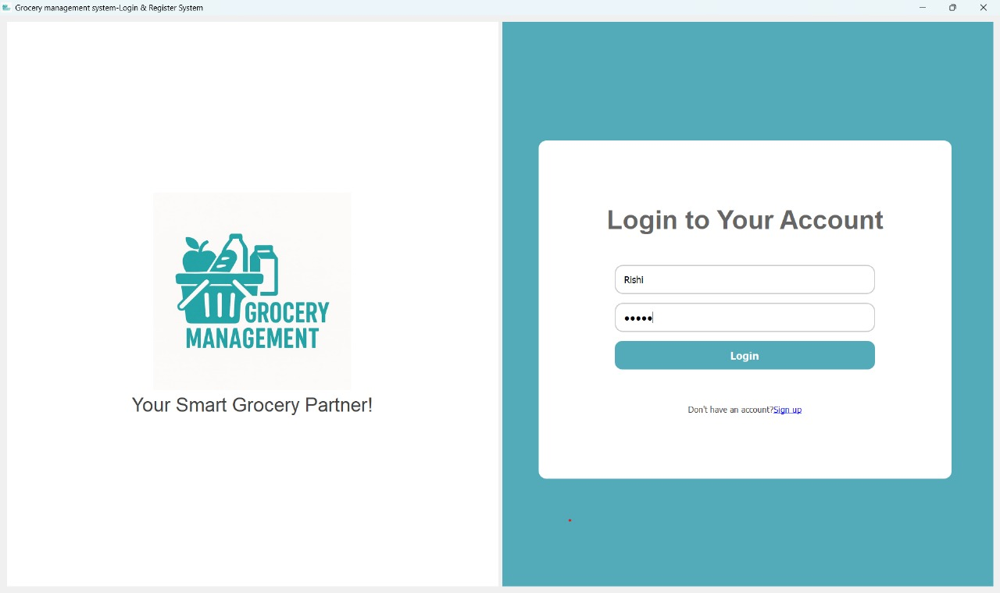
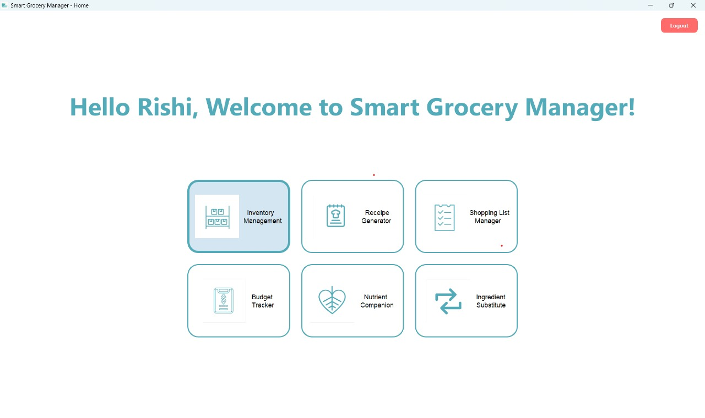

# Household Grocery Management System

A desktop application designed to simplify household grocery management.  
Track your inventory with expiry alerts,explore recipes, auto-generate shopping lists,monitor your budget through interactive graphs, ensure a balanced diet , and find ingredient substitutes instantly,— all from one beautifully crafted interface.

Developed using **Python and PyQt5**, this app blends functionality and intelligence to support smarter, healthier, and more organized living.


---
##  Features

- **Inventory Tracking with Expiry Alerts**  
  Add grocery items with quantity, category & expiry. Get notified before things expire.

- **Recipe Generator**  
  Enter a dish name and get the list of ingredients and step-by-step method.

- **Shopping List Manager**  
  Auto-generates shopping lists from finished/expired.

- **Budget Tracker with Graphs**  
  Keep your Grocery spending in check.

- **Nutritional Analyzer**  
  Input your meals and get feedback on diet balance (proteins, carbs, fats, etc.)

- **Ingredient Substitute Finder**  
  Suggests alternatives for missing ingredients using a prebuilt substitution dataset.

---

## Tech Stack

| Tool             | Purpose                        |
|------------------|--------------------------------|
| Python           | Core programming               |
| PyQt5            | GUI interface                  |
| JSON             | Data storage                   |
| `speech_recognition` | Voice input                 |
| `pyttsx3`        | Text-to-speech (speak aloud)   |
| `pyperclip`      | Clipboard access               |
| `fpdf`           | PDF export                     |
| `matplotlib.pyplot` | Budget graphs               |

---

## Dependencies

Install required Python libraries with pip:

```bash
pip install pyqt5
pip install speechrecognition
pip install pyttsx3
pip install pyperclip
pip install fpdf
pip install matplotlib
```
---
## Project Screenshots

### Login Page


### Home Page


### Inventory Page


## Authors


- **Navya Alikanti**  
- **Vijaya Sree Mallikanti** 


